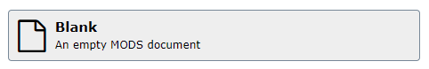
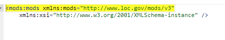
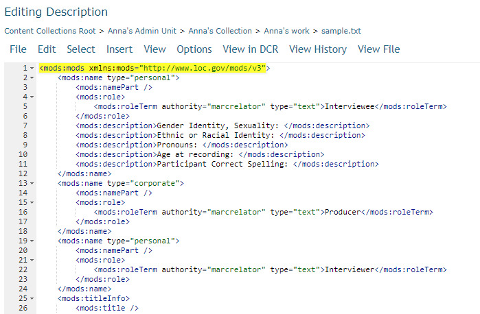

# DCR MODS Editor templates

Located here are blank MODS records pre-populated with fields used by specific projects, which have not been added as a repository-wide template option in the Edit Description menu.

To edit the description of an object using one of these pre-populated templates, select Edit Description from the gear menu. From there, select the Blank template.

In the Editing Description interface, change to the XML view. Delete the existing XML.

Copy the MODS with the pre-populated fields and paste it into the window.

From here you can either proceed with adding your data in the XML view or switch over to the Form view.
