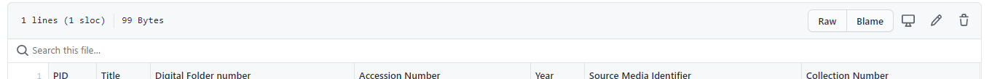
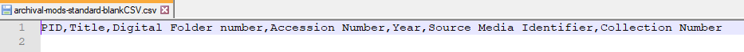
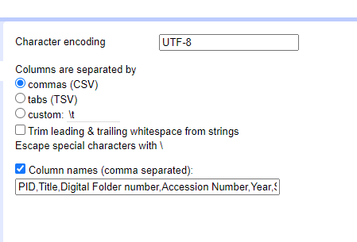
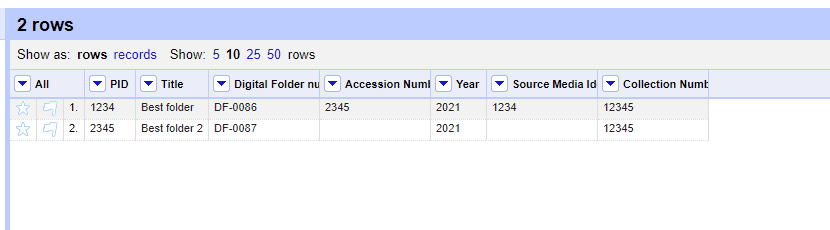
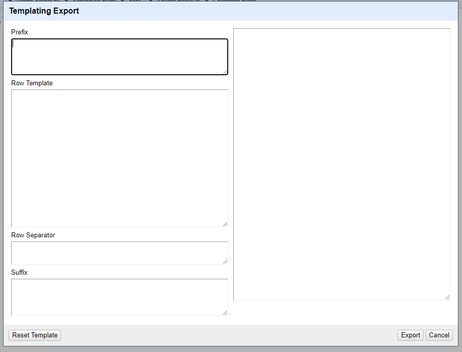
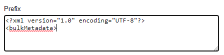
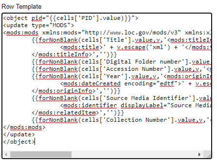
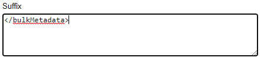
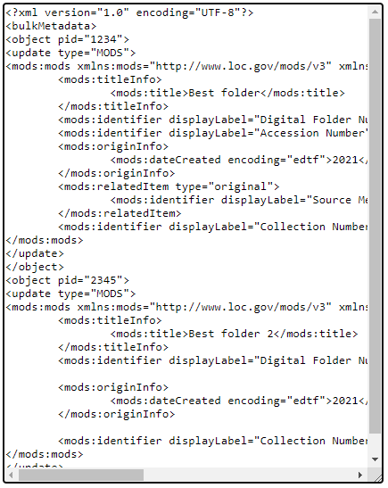
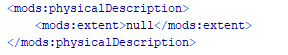

# Open Refine to MODS workflow
This workflow involves creating and uploading a CSV to OpenRefine and then using OpenRefine's templating export function and the XML template files in this directory to generate MODS XML.
## Create CSV
There are blank CSVs available here which correspond to each OpenRefine export template. You can use these as a starting point for creating the CSV with your metadata that you will use to generate MODS. Note that if you change the name of one of the columns in the CSV you will need to edit the OpenRefine template as well or the data in that column will not be converted to MODS. To download a CSV, click the **Raw** button to open it in the browser and then right click > save as to save the file. 

## Edit and save CSV
Open CSV in Excel and enter your metadata. When you are finished, delete the first row of the spreadsheet with the column names, and File > Save as "CSV UTF-8 (comma delimited)".

## Upload CSV to OpenRefine
Open the original "-blankCSV" file in a text editor. This will be used to create the column names in OpenRefine.

Upload the CSV to OpenRefine. On the **Create Project** page, make sure **Character encoding** is UTF-8 and Commas (CSV) is selected under **Columns are separated by**. Copy the column names from the "-blankCSV" file and enter them in the **Column names (comma separated)** box. 

If the preview looks good, select **Create Project**.

Confirm that your metadata appears as expected. Perform any desired cleanup.
## Export CSV as MODS
1. In the **Export** dropdown menu, select **Templating...**. In the Templating Export window, there will be four sections on the left and a preview section on the right. The tool is set up to generate JSON by default. Delete all of the code that has been automatically populated in the left four sections.

2. Open the "-OR.xml" export template that corresponds to your metadata/CSV.
3. Copy the code in the `<!-- For Prefix -->` section and paste it into the **Prefix** section in the Templating Export window.

4. Copy the code in the `<!-- For Row Template -->` section and paste it into the **Row Template** section in the Templating Export window.

5. In the **Row Separator** section, insert a line break.

6. Copy the closing `</bulkMetadata>` tag at the end of the file and paste it in the **Suffix** section.

7. Preview the MODS in the section on the right and confirm that it looks as expected.

8. When you're ready to proceed with the export, click the **Export** button on the bottom right of the window.
9. Name your MODS file and save it with the ".xml" file extension.
10. Open the MODS file in Oxygen. Many of the OpenRefine templates are set up to ignore blank cells in the CSV when exporting, but as an extra QA step perform a search for the word "null" to find any that may have been created.

Delete any of these null fields before uploading to DCR. If you regularly have a column in your data with blank fields that the OpenRefine export template is not set up to handle, you can [open an issue](https://github.com/UNC-Libraries/Metadata-Miscellany/issues) asking for that export template to be edited accordingly.

11. Validate the XML syntax by going to Document > Validate > Check Well-Formedness.
